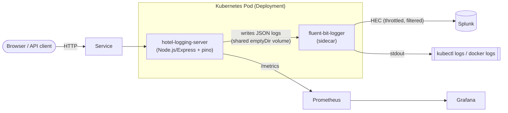

# Hotel Booking Logging App

A hotel-booking API and logging pipeline used to demonstrate how to keep a
high-traffic web application observable **without** the huge log volume that
originally caused the performance issue described below.

> **Original issue:** *"Online Hotel booking System is having performance
> issue. Issue was identified due to huge logging being done by system which
> is resulting in high resource utilization hampering the performance."*
>
> **Solution:** containerize the application (Node.js/Express API + Fluent
> Bit sidecar), keep logs structured and sampled at the source, forward a
> reduced, high-value stream to Splunk, and orchestrate everything on
> Kubernetes for scaling/availability.

## Architecture



- **hotel-logging-server** — Express + TypeScript API, structured JSON logs
  (pino), request-id correlation, log sampling/rate-limiting, Prometheus
  metrics.
- **fluent-bit-logger** — sidecar that tails the app's JSON log file,
  enriches, filters (drops `DEBUG`), throttles, and forwards to Splunk HEC
  and stdout.
- **Splunk** — indexes/searches the reduced log stream.
- **Prometheus/Grafana** — scrape `/metrics` for request rate, latency and
  log-volume counters.

## Repository layout

| Path | Purpose |
|------|---------|
| `app/` | Node.js/TypeScript Express hotel-booking API, tests, load generator, static frontend |
| `docker/` | Multi-stage Dockerfiles for the webserver and Fluent Bit sidecar |
| `fluent-bit/` | Fluent Bit `fluent-bit.conf` / `parsers.conf` used by the Docker image and Kubernetes ConfigMap |
| `k8s-manifests/` | Plain Kubernetes manifests (Deployment, Service, ConfigMap, Secret, HPA, PDB, NetworkPolicy, Ingress, ServiceAccount) |
| `charts/logging-app/` | Helm chart wrapping the manifests above |
| `ADOPS/pipeline.yaml` | Azure DevOps pipeline (Build → Scan → Push → Deploy) |
| `.github/workflows/ci.yml` | GitHub Actions CI (lint/test/build, Docker build, Trivy scan, helm lint/kubeconform) |
| `docs/` | Architecture, runbook and logging-strategy docs |

## Quickstart (Docker Compose)

```bash
cd app && npm ci && npm test && npm run build && cd ..
docker compose up --build
```

This starts:

- `app` — the API on http://localhost:8080 (`/healthz`, `/readyz`, `/metrics`, `/api/hotels`, static UI at `/`)
- `fluent-bit` — tails the app's logs and forwards them to the mock Splunk HEC endpoint and stdout
- `splunk-hec` — an HTTP echo mock standing in for Splunk HEC (`docker compose logs splunk-hec` shows received events)
- `prometheus` — scrapes `app:8080/metrics` (http://localhost:9090)
- `grafana` — http://localhost:3000 (default admin/admin)

Generate load to see sampling/throttling in action:

```bash
cd app && npm run loadgen -- --rps 50 --duration 30
```

## Kubernetes / Helm

```bash
helm lint charts/logging-app
helm upgrade --install hotel-logging charts/logging-app \
  --namespace hotel --create-namespace \
  --set splunk.token=<your-hec-token> \
  --set splunk.hecHost=<splunk-host>
kubectl -n hotel get pods,svc,hpa,pdb
```

Plain manifests (no Helm) are still available under `k8s-manifests/` and can
be applied directly with `kubectl apply -f k8s-manifests/`.

## Configuration

| Variable | Component | Default | Description |
|----------|-----------|---------|--------------|
| `PORT` | app | `8080` | HTTP listen port |
| `LOG_LEVEL` | app | `info` | pino log level (`debug`, `info`, `warn`, `error`) |
| `LOG_FILE` | app | unset | If set, tee JSON logs to this file for Fluent Bit to tail |
| `LOG_SAMPLE_RATE` | app | `0.1` | Fraction (0-1) of high-volume route logs kept |
| `LOG_MAX_PER_WINDOW` | app | `20` | Max sampled logs per route per window |
| `LOG_WINDOW_MS` | app | `1000` | Sampling window size (ms) |
| `REQUEST_TIMEOUT_MS` | app | `5000` | Per-request timeout |
| `SPLUNK_HEC_HOST` / `SPLUNK_HEC_PORT` / `SPLUNK_HEC_TLS` | fluent-bit | — | Splunk HEC endpoint |
| `SPLUNK_TOKEN` | fluent-bit | — | Splunk HEC token (from Secret) |
| Helm `fluentBit.throttle.rate` / `.window` | fluent-bit | `100` / `60` | Throttle filter rate limiting |

## Reducing log volume (the original problem)

The original incident was caused by excessive logging under load. This repo
addresses it at multiple layers:

1. **App-level sampling** (`app/src/lib/sampler.ts`) — high-volume routes
   (`/healthz`, `/readyz`, `/metrics`) are logged at a configurable sample
   rate and capped per time window, instead of on every request.
2. **Structured, leveled logging** (pino) — `LOG_LEVEL` controls verbosity;
   `DEBUG` logs are never emitted in production configurations.
3. **Redaction** — secrets/PII fields are redacted before serialization so
   payloads stay small and safe to forward.
4. **Fluent Bit filtering & throttling** — the sidecar's `grep` filter drops
   remaining `DEBUG` records and a `throttle` filter caps the events/sec
   forwarded to Splunk, protecting both the node and the Splunk HEC ingest
   pipeline.
5. **Buffered, retried delivery** — `storage.type filesystem` buffering with
   bounded `mem_buf_limit`/retry limits prevents unbounded memory growth if
   Splunk is briefly unavailable.
6. **Prometheus log-volume counter** — `/metrics` exposes a counter of logs
   emitted per level/route so volume regressions are visible before they
   become an incident.

## Splunk query examples

Word-frequency example (kept from the original assignment):

```
index="hotel_logs" sourcetype="fluentbit_logs" | rex field=_raw "(?<words>\w+)" max_match=100 | mvexpand words | stats count by words | sort - count
```

Request latency / error-rate example using the structured fields emitted by
this app (`ts`, `level`, `request_id`, `route`, `status`, `latency_ms`):

```
index="hotel_logs" sourcetype="fluentbit_logs"
| spath
| stats avg(latency_ms) as avg_latency_ms, p95(latency_ms) as p95_latency_ms, count by route status
| sort - p95_latency_ms
```

## CI/CD

- `ADOPS/pipeline.yaml` — Azure DevOps pipeline: Build (lint/test/build) →
  Scan (helm lint/kubeconform) → Push (Docker build + Trivy) → Deploy
  (`helm upgrade --install`).
- `.github/workflows/ci.yml` — GitHub Actions equivalent for lint/test/build,
  Docker Buildx build + Trivy scan, and `helm lint`/`kubeconform` manifest
  validation.

## Further reading

- [`docs/architecture.md`](docs/architecture.md)
- [`docs/logging-strategy.md`](docs/logging-strategy.md)
- [`docs/runbook.md`](docs/runbook.md)
- [`CONTRIBUTING.md`](CONTRIBUTING.md)
